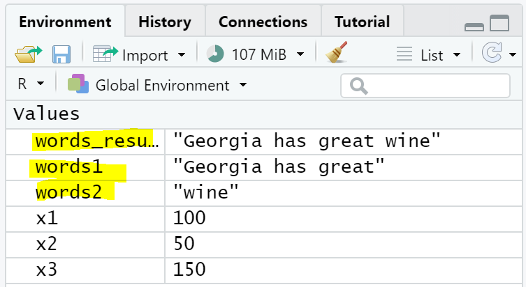

```{r setup, include = FALSE}
# Load packages
library(knitr)
library(xaringanExtra)
library(here)
here::i_am("1-introduction-to-r.Rmd")
options(htmltools.dir.version = FALSE)
opts_chunk$set(
  fig.align = "center",
  fig.height = 4,
  dpi = 300,
  cache = T
  )
xaringanExtra::use_panelset()
xaringanExtra::use_webcam()
xaringanExtra::use_clipboard()
htmltools::tagList(
  xaringanExtra::use_clipboard(
    success_text = "<i class=\"fa fa-check\" style=\"color: #90BE6D\"></i>",
    error_text = "<i class=\"fa fa-times-circle\" style=\"color: #F94144\"></i>"
  ),
  rmarkdown::html_dependency_font_awesome()
)
xaringanExtra::use_logo(
  image_url = here("img",
                   "lightbulb.png"),
  exclude_class = c("inverse", 
                    "hide_logo"),
  width = "50px"
)
```

```{css, echo = F, eval = T}
@media print {
  .has-continuation {
    display: block !important;
  }
}
```

# Table of contents // სარჩევი

1. [Introduction](#intro)
1. [Data work and statistical programming](#data-work)
1. [Statistical programming](#statistical-programming)
1. [Writing R code](#writing-r-code)
1. [Data in R](#data-in-r)
1. [Object types](#object-types)
1. [Functions in R](#functions-in-r)
1. [Wrapping up](#wrapping-up)
1. [Appendix](#appendix)

---

class: inverse, center, middle
name: intro

# Introduction // შესავალი

<html><div style='float:left'></div><hr color='#D38C28' size=1px width=1100px></html>

---


## Object types: character strings

```{r echo = FALSE, out.width="60%"}

```